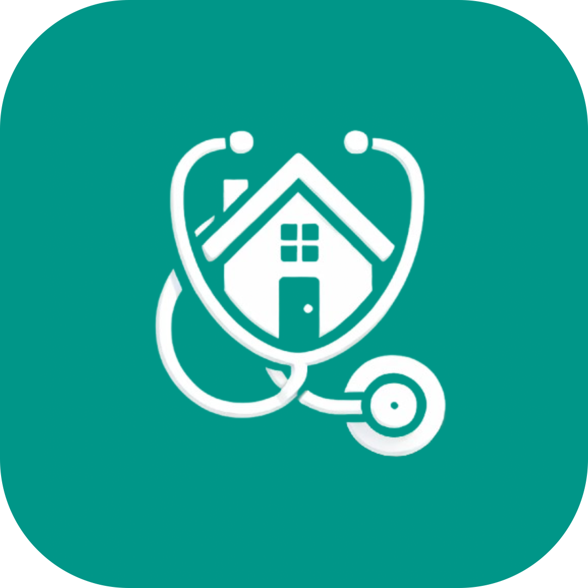
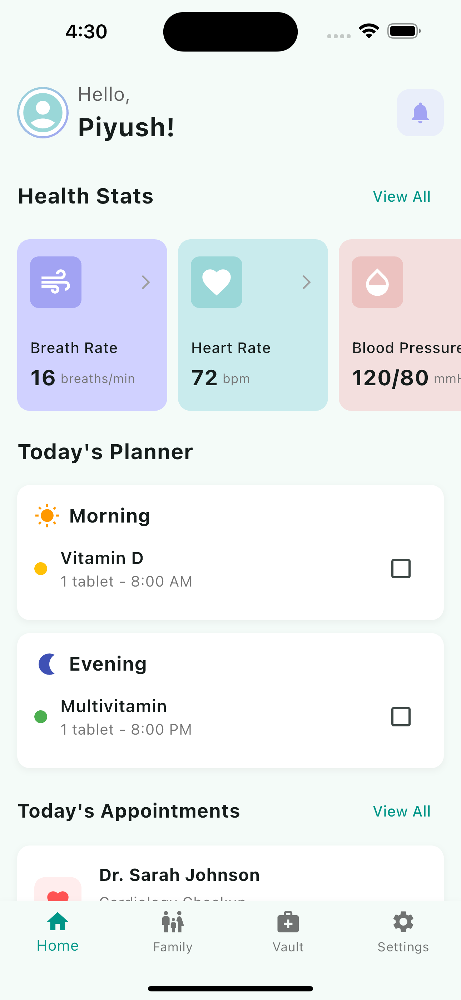
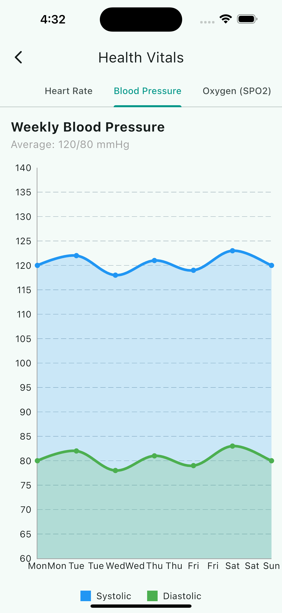
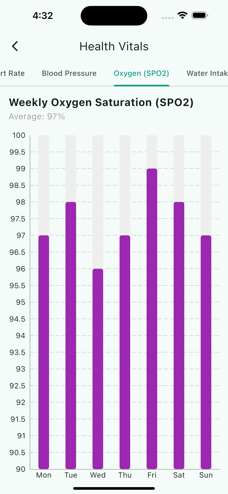
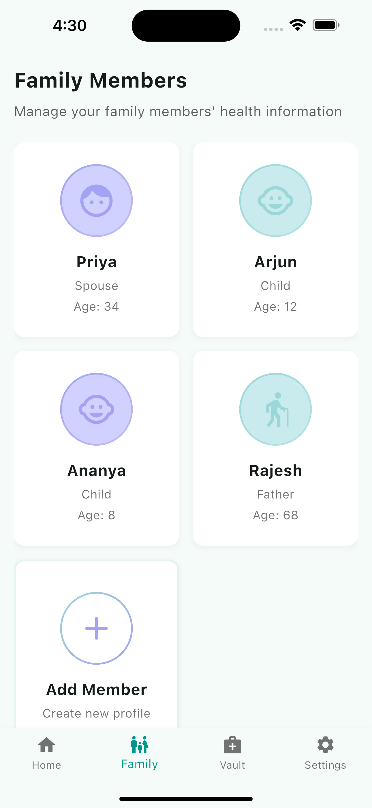
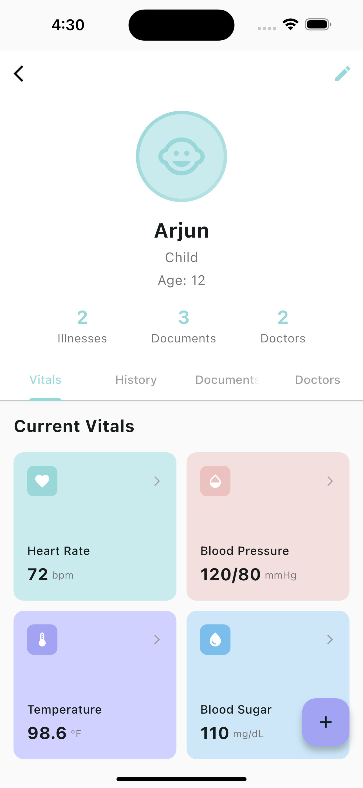
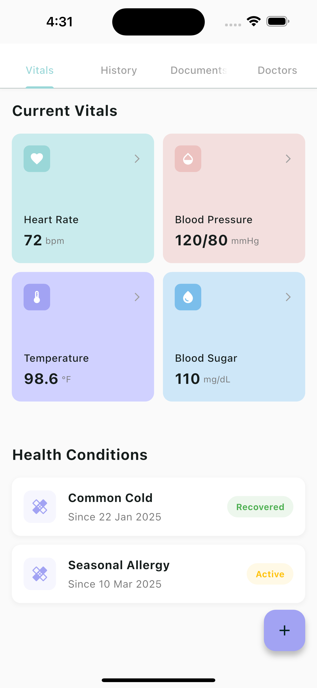
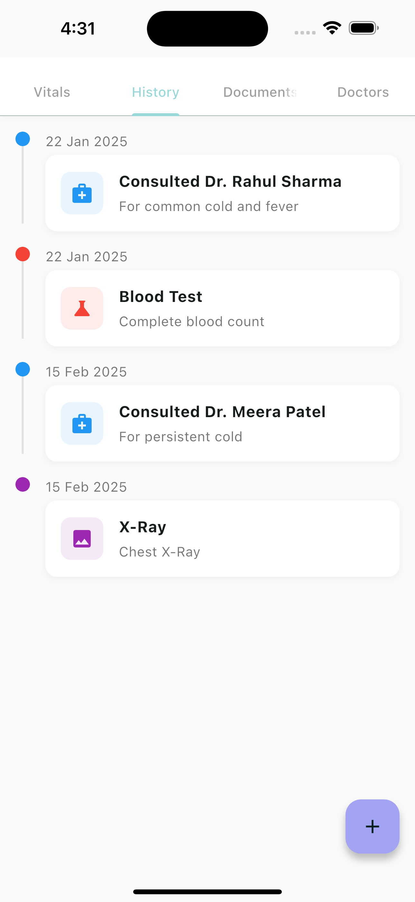
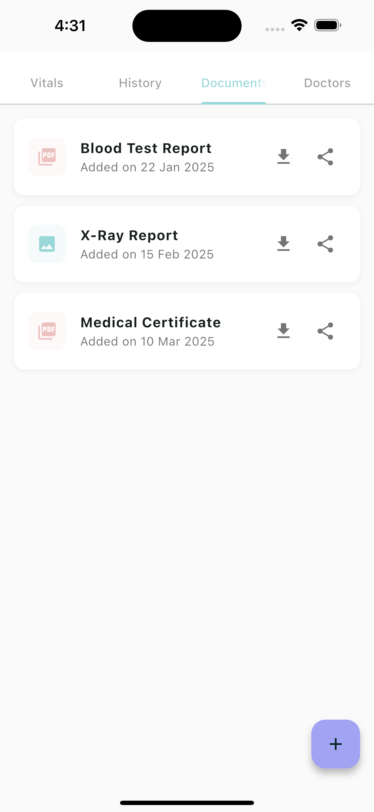
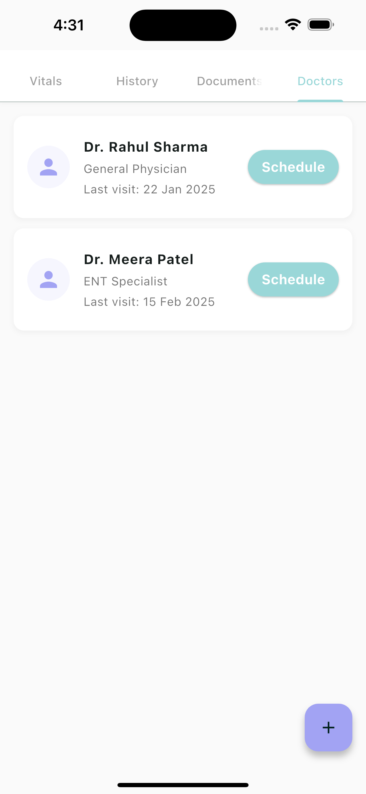

<p align="center">
  
</p>

# 🩺 WellNest – Your Family's Wellness, All in One Nest

A Flutter-based mobile app that centralizes and simplifies home healthcare. From managing digital health records to sending smart alerts, this app ensures proactive care for every family member.

---

## 🚀 Features

### Health History Vault
- Securely store and manage the full medical history of all family members
- Generate comprehensive health reports for healthcare provider visits

### Patient Smart Planner
- Track meds, tests, inventory, and treatments for ongoing conditions
- Receive intelligent scheduling suggestions based on treatment history

### Health Connect Integration
- Sync real-time vitals like heart rate, SpO2, and steps from Google Fit and Apple Health
- Visualize health trends with intuitive charts and personalized insights

### Online Health Consultancy
- Instantly consult doctors via chat or video, without third-party apps
- Access specialist referrals and second opinions through our verified network

### Mental Health Bot
- AI companion for mood tracking, coping tips, and emotional check-ins
- Practice guided meditation and mindfulness exercises tailored to your needs

### Medical Document Upload
- Upload, organize, and access health documents anytime, anywhere
- Secure document sharing with customizable privacy controls for healthcare providers

### Smart Health Alerts
- Get timely alerts on missed meds, critical vitals, or upcoming checkups
- Receive personalized health recommendations based on your family's health patterns

---

## 📱 Screenshots

<p align="center">
  
  
  
</p>

<p align="center">
  
  
  
</p>

<p align="center">
  
  
  
</p>

---

## 🛠️ Tech Stack

### Frontend
- **Flutter** – Cross-platform UI
- **Dart** – Language used
- **Provider** – For state management

### Backend
- **Python** – Server-side language
- **Flask** – Web framework for the API
- **SQLAlchemy** – ORM for database operations
- **Docker** – Containerization for easy deployment

### Communication
- **REST APIs** – Frontend-backend communication
- **Dio** – HTTP client for API calls

---
## 🧪 Getting Started

### Prerequisites

- Flutter SDK installed
- Android Studio / Xcode / VS Code
- Emulator or physical device
- Python 3.8+ installed (for server)
- Docker and Docker Compose (optional, for containerized server)

### Steps

1. Clone the repo
```bash
git clone https://github.com/Dusk-afk/well_nest.git
```

2. Navigate to the project directory
```bash
cd well_nest
```

3. Install Flutter dependencies
```bash
flutter pub get
```

4. Start the backend server

Option A: Direct Python execution
```bash
cd server
pip install -r requirements.txt
python app.py
```

Option B: Using Docker
```bash
cd server
docker-compose up -d
```

5. Run the Flutter app
```bash
flutter run
```

The server will be available at http://localhost:5000
